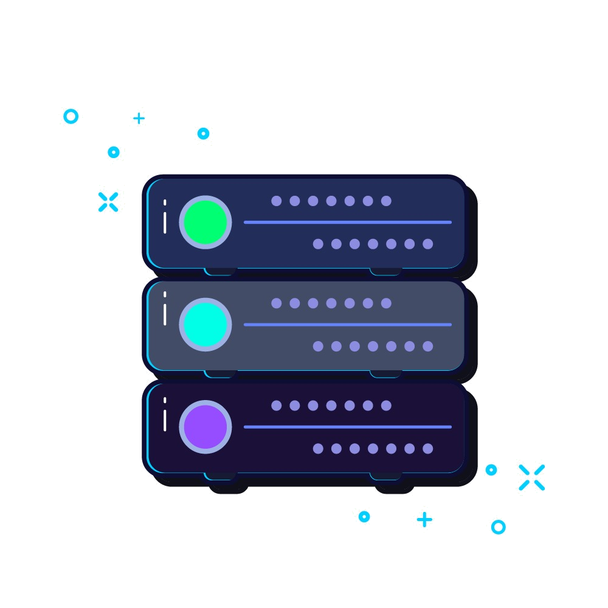
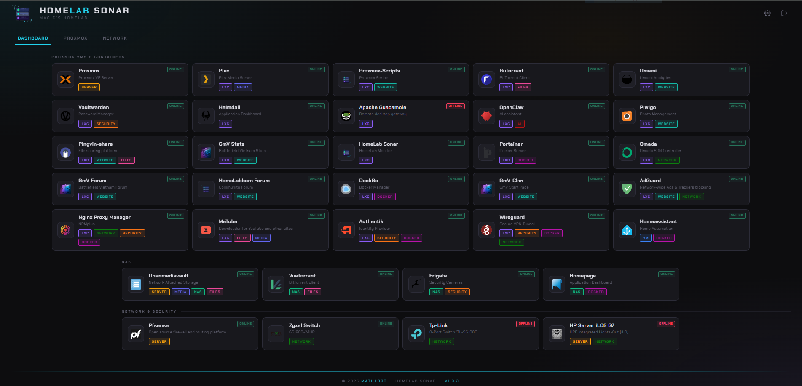
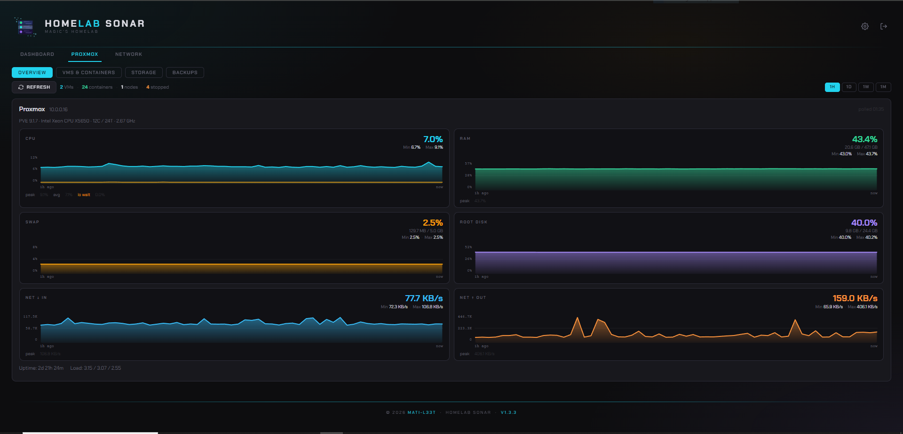
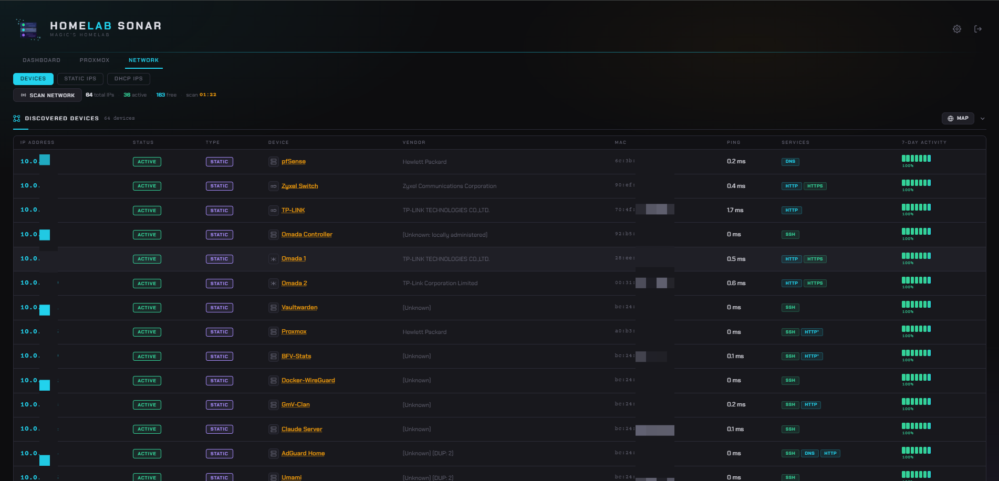
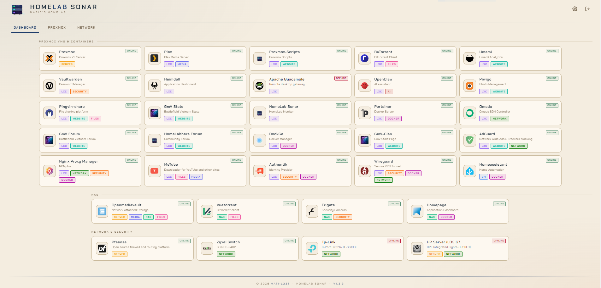
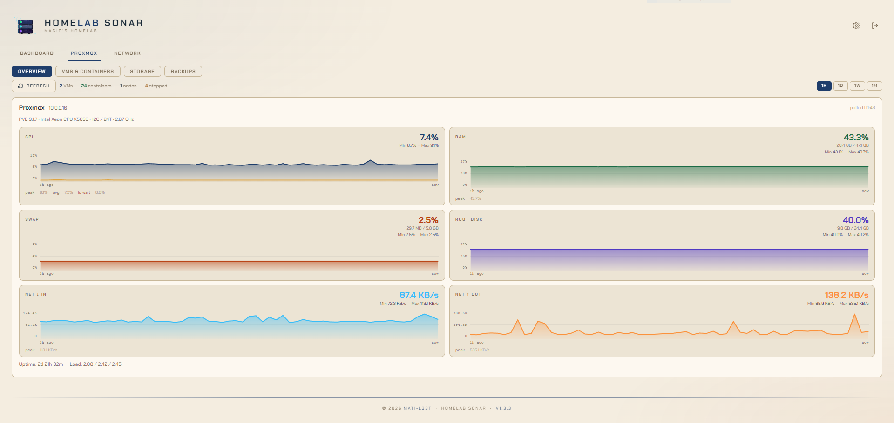
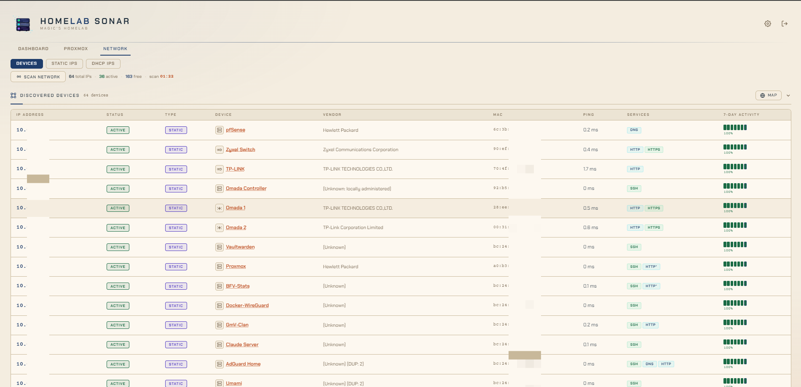

<div align="center">



# HomeLab Sonar

**Open-source, self-hosted home lab dashboard — LAN scanner, network monitor, Proxmox manager, and app launcher in one place.**

[](https://github.com/Mati-l33t/lan-tracker-network-sonar/releases)
[](LICENSE)
[](https://github.com/Mati-l33t/lan-tracker-network-sonar/stargazers)

</div>

---

## Screenshots

<div align="center">

 

 

 

</div>

---

## Features

- **Application dashboard** — self-hosted app launcher and link board with favicons, selfhst icons, collapsible categories, tags, drag-and-drop ordering, and live ONLINE/OFFLINE status badges
- **Live network scan** — discovers all active devices via ARP with vendor lookup
- **IP address management** — static & DHCP ranges, free IP tracking, custom device names
- **Device details** — MAC address, hostname, vendor, ping latency, open ports
- **7-day uptime sparklines** — visual activity history per device
- **Proxmox monitoring** — real-time CPU, RAM, swap, disk, and network I/O per node; VM/LXC power control; backup viewer
- **Network map** — visual topology of discovered devices
- **Dark / Light theme** — persistent across sessions
- **Password protection** — optional login; enable or disable without losing your password
- **System log viewer** — live log panel in Settings showing startup, scan, and error events
- **One-command install** — single line for Debian/Ubuntu; Proxmox LXC installer included
- **Auto-restart** — runs as a systemd service, survives reboots

---

## Quick Install — Debian / Ubuntu

```bash
bash <(curl -fsSL https://raw.githubusercontent.com/Mati-l33t/lan-tracker-network-sonar/main/install.sh)
```

> **Requirements:** Debian 11+ or Ubuntu 20.04+, root access, internet connection.

The installer will:
1. Install all dependencies (MariaDB, arp-scan, Python 3, git)
2. Clone the repo to `/opt/lan-tracker`
3. Generate a random database password
4. Create and enable a systemd service
5. Print the URL to open in your browser

---

## First Login & Password Setup

After installation the app is accessible to anyone on your network with no password. **Set a password immediately** after install.

Open the app in your browser, go to **Settings → System → Password Management** and set your password directly in the UI — no current password required on first setup.

You can also toggle **Disable Password Login** in that same panel to allow open access even when a password is set — useful for trusted home networks.

Alternatively, set the password from the command line on the server:

```bash
python3 /opt/lan-tracker/scripts/set-password.py
```

Then restart the service:

```bash
systemctl restart lan-tracker
```

Once a password is set, the login page will be shown on every visit (unless login is disabled in settings).

---

## Proxmox LXC Install

Run on your **Proxmox VE host** (not inside a VM or container):

```bash
bash <(curl -fsSL https://raw.githubusercontent.com/Mati-l33t/lan-tracker-network-sonar/main/proxmox/install.sh)
```

You will be prompted to choose:

| Mode | Description |
|---|---|
| **Default** | Debian LXC · 1 CPU · 512 MB RAM · 4 GB disk · DHCP — no further questions |
| **Advanced** | Choose CT ID, hostname, CPU cores, RAM, disk, storage pool, bridge, static IP |

The script downloads the Debian template if needed, creates the container, and runs the full installer inside it.

---

## Proxmox Monitoring Setup

HomeLab Sonar connects to Proxmox VE via an API token. Run this one-liner **on your Proxmox VE host shell** to create one:

```bash
bash <(curl -fsSL https://raw.githubusercontent.com/Mati-l33t/lan-tracker-network-sonar/main/proxmox/setup-token.sh)
```

This creates the `monitoring@pam` user, a minimal `LanTrackerRole`, and an API token — then prints the token secret for you to copy. Safe to re-run at any time.

The token secret is shown once when created. Then in HomeLab Sonar go to **Settings → Proxmox → Add Host** and enter:

| Field | Value |
|---|---|
| Token ID | `monitoring@pam!lan-tracker` |
| Token Secret | *(the secret shown above)* |

**What the token can do:**

| Privilege | Purpose |
|---|---|
| `VM.Audit` | Read VM / container details |
| `VM.PowerMgmt` | Start, stop, reboot, shutdown VMs and containers |
| `Sys.Audit` | Read node stats, task logs, backup schedules |
| `Datastore.Audit` | Read storage content |
| `SDN.Audit` | Read SDN/network info |

It cannot create or delete VMs, modify configs, manage users, or access backup file contents on CIFS/NFS shares (see note below).

> **CIFS/NFS backup storage:** Due to a Proxmox API limitation, backup files on CIFS or NFS shares are not visible to non-root tokens via the content API. HomeLab Sonar automatically falls back to reading vzdump task logs to reconstruct the backup list — no extra setup or elevated permissions needed.

---

## Update

HomeLab Sonar checks for updates automatically in the background (every 6 hours) and shows an amber dot on the Settings gear icon when a new version is available.

To update from the web UI: open **Settings → System → Software Update** and click **Update Now**. The service will restart automatically when done.

To update from the command line:

```bash
bash <(curl -fsSL https://raw.githubusercontent.com/Mati-l33t/lan-tracker-network-sonar/main/update.sh)
```

---

## Uninstall

```bash
bash <(curl -fsSL https://raw.githubusercontent.com/Mati-l33t/lan-tracker-network-sonar/main/uninstall.sh)
```

This removes the application, service, config, and database entirely.

---

## Configuration

Network configuration (subnet, static range, DHCP range) is done through the **web UI** — no config file editing needed.

The app's runtime settings (DB credentials, port) live in `/etc/lan-tracker/lan-tracker.conf` and are generated automatically during installation:

```ini
LT_DB_HOST=localhost
LT_DB_NAME=lan_tracker
LT_DB_USER=lantracker
LT_DB_PASS=<auto-generated>
LT_PORT=8080
LT_SECRET_KEY=<auto-generated>
LT_AUTH_ENABLED=true
```

To change the port, edit this file and restart the service:

```bash
systemctl restart lan-tracker
```

---

## Reverse Proxy & HTTPS

HomeLab Sonar runs on plain HTTP (`http://your-ip:8080`) by default. This is fine for use inside a trusted home network. **If you want to expose it to the internet, put it behind a reverse proxy that handles HTTPS.** Without HTTPS, your password and session cookie travel over the network in cleartext.

### Recommended tools

| Tool | Notes |
|---|---|
| **[Nginx Proxy Manager](https://nginxproxymanager.com)** / **[NPMplus](https://github.com/ZoeyVid/NPMplus)** | GUI-based, easiest for homelabs; handles Let's Encrypt automatically |
| **[Caddy](https://caddyserver.com)** | Single config file, automatic HTTPS out of the box |
| **[Traefik](https://traefik.io)** | Popular with Docker setups; label-based config |
| **[nginx](https://nginx.org)** | Manual but full control; plenty of homelab guides available |

Point your proxy at `http://127.0.0.1:8080` (or the host IP if the proxy runs on a different machine).

### VPN — the safer alternative

If you only need remote access for yourself, a VPN is more secure than port-forwarding:

- **[Tailscale](https://tailscale.com)** — zero-config, works without port forwarding, free tier covers personal use
- **[WireGuard](https://www.wireguard.com)** — fast and lightweight; many Proxmox/homelab guides available

With a VPN you reach your HomeLab Sonar instance over the encrypted tunnel exactly as if you were on your home network — no public exposure needed.

---

## Service Management

```bash
systemctl status  lan-tracker    # Check status
systemctl restart lan-tracker    # Restart
journalctl -u lan-tracker -f     # Live logs
```

---

## Contributing

1. Fork the repository
2. Create a feature branch: `git checkout -b feature/my-feature`
3. Commit your changes
4. Open a Pull Request

Please use the issue templates for bug reports and feature requests.

---

## License

[MIT](LICENSE) © [Mati-l33t](https://github.com/Mati-l33t)
